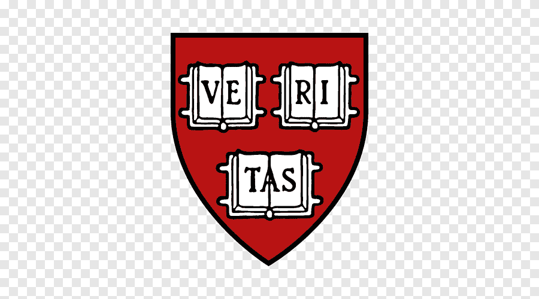
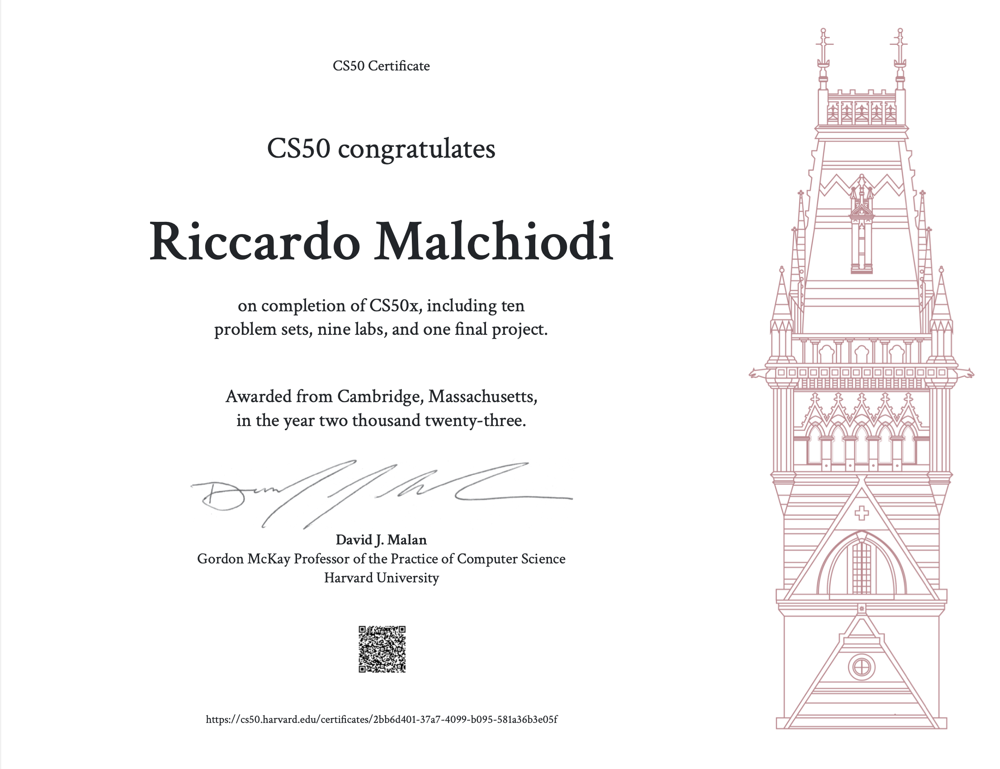
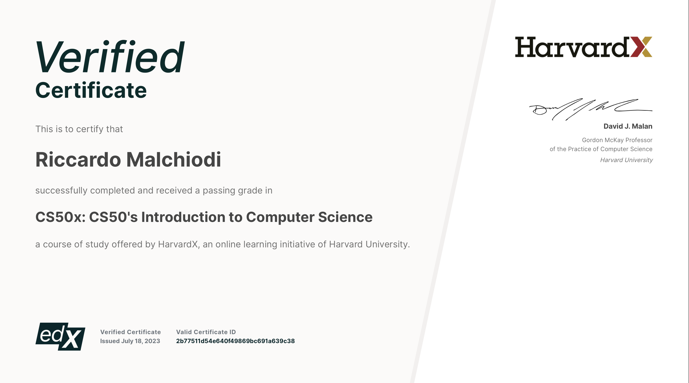

# &nbsp; Harvard University - CS50x

Presented by EdX - https://www.edx.org/course/introduction-computer-science-harvardx-cs50x

CS50 Syllabus - https://cs50.harvard.edu/x/2023/

Harvard University - https://www.harvard.edu/

Problem sets - https://cs50.harvard.edu/x/2023/psets/

CS50 C Manual Pages -  https://manual.cs50.io/

## About 

This is CS50, Harvard University’s introduction to the intellectual enterprises of computer science and the art of programming, for concentrators and non-concentrators alike, with or without prior programming experience. (Two thirds of CS50 students have never taken CS before.) This course teaches you how to solve problems, both with and without code, with an emphasis on correctness, design, and style. Topics include computational thinking, abstraction, algorithms, data structures, and computer science more generally. Problem sets inspired by the arts, humanities, social sciences, and sciences. More than teach you how to program in one language, this course teaches you how to program fundamentally and how to teach yourself new languages ultimately. The course starts with a traditional but omnipresent language called C that underlies today’s newer languages, via which you’ll learn not only about functions, variables, conditionals, loops, and more, but also about how computers themselves work underneath the hood, memory and all. The course then transitions to Python, a higher-level language that you’ll understand all the more because of C. Toward term’s end, the course introduces SQL, via which you can store data in databases, along with HTML, CSS, and JavaScript, via which you can create web and mobile apps alike. Course culminates in a final project

## Structure
Lecture 00 - Scratch  
Lecture 01 - C  
Lecture 02 - Arrays  
Lecture 03 - Algorithms  
Lecture 04 - Memory  
Lecture 05 - Data Structures  
Lecture 06 - Python  
Lecture 07 - SQL  
Lecture 08 - HTML, CSS, JavaScript  
Lecture 09 - Flask  
Lecture 10 - Emoji  
Cybersecurity  
Final Project  

## Instructors

David J. Malan - Gordon Mckay Professor of the Practice of Computer Science at Harvard University

Doug Lloyd - Senior Preceptor in Computer Science at Harvard University

Brian Yu - Senior Preceptor in Computer Science at Harvard University

## My CS50 Gradebook

| Week      | Type | Title | Grade|
| ----------- | ----------- | ----------- | ------------- |
| 0      | ProblemSet | Scratch    | 
| 1      | Lab 1       | Population    | 
| 1      | ProblemSet  | Hello    | 
| 1      | ProblemSet  | Mario    | 
| 1      | ProblemSet  | Cash    | 
| 2      | Lab 2  | Scrabble    | 
| 2      | ProblemSet  | Readability    | 
| 2      | ProblemSet  | Bulbs    | 
| 3      | Lab 3  | Sort    | 
| 3      | ProblemSet  | Plurality    | 
| 3      | ProblemSet  | Runoff    | 
| 4      | Lab 4 | smiley    | 
| 4      | ProblemSet  | Filter-less      | 
| 4      | ProblemSet  | Recover      | 
| 5      | Lab 5       | Inheritance | 
| 5      | ProblemSet  | Speller      | 
| 6      | Lab 6       | World Cup     | 
| 6      | ProblemSet  | Hello      | 
| 6      | ProblemSet  | Mario-less     | 
| 6      | ProblemSet  | Cash      | 
| 6      | ProblemSet  | Readability     | 
| 6      | ProblemSet  | DNA      | 
| 7      | Lab 7 | Songs      | 
| 7      | ProblemSet  | Movies      | 
| 7      | ProblemSet  | Fiftyville      | 
| 8      | Lab 8 | Trivia      | 
| 8      | ProblemSet  | Homepage      | 
| 9      | Lab 9 | Birthdays      | 
| 9      | ProblemSet  | Finance      | 
| FP      | FInal Project  | Final Project     | 

## Certificate 
I completed the CS50 course from Harvard on July 4, 2023, and it was a great experience. This course not only provided me with valuable knowledge in computer science but also served as a foundation for the beginning of my academic journey at the university.

CS50 Certificate Link: https://cs50.harvard.edu/certificates/2bb6d401-37a7-4099-b095-581a36b3e05f

Verified Certificate From edX: https://courses.edx.org/certificates/2b77511d54e640f49869bc691a639c38?_gl=1*agmozv*_ga*MTUwMjQwNDMwNC4xNjk5OTUwNDA2*_ga_D3KS4KMDT0*MTcwMDQ4NTQxOC42LjEuMTcwMDQ4NTUxOS4yNi4wLjA.

